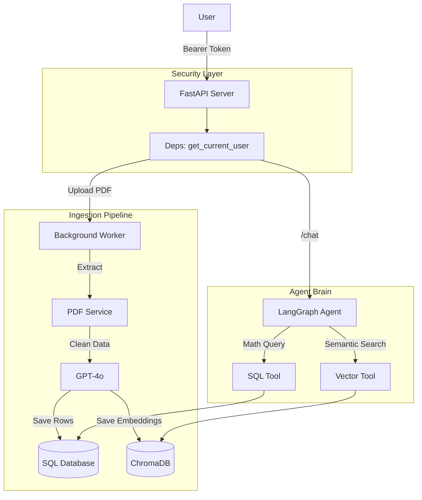

# Financial Advisor Agent - Project Walkthrough

## 1. Project Overview
We have built a production-ready **Financial Advisor Agent** backend.
It uses **RAG (Retrieval Augmented Generation)** to answer questions about your financial data (PDF Bank Statements).

### Core Capabilities
*   **Secure**: JWT Authentication (Login/Signup).
*   **Ingestion**: Upload PDF statements -> Text Extraction -> Data Cleaning (LLM) -> SQL & Vector DB.
*   **Storage**: Hybrid Memory (SQL for Math, ChromaDB for Semantic Search).
*   **Reasoning**: LangGraph Agent that routes queries to the correct tool.

## 2. Architecture



## 3. How to Run

### Prerequisites
*   Python 3.10+
*   OpenAI API Key

### Setup
1.  **Clone & Install**:
    ```bash
    python -m venv venv
    venv\Scripts\activate
    pip install -r requirements.txt
    ```

2.  **Environment**:
    Create a `.env` file in the root:
    ```ini
    OPENAI_API_KEY=sk-proj-your-key-here
    SECRET_KEY=your-secret-key
    ```

3.  **Initialize Database**:
    ```bash
    python app/init_db.py
    ```

4.  **Run Server**:
    ```bash
    uvicorn app.main:app --reload
    ```
    Access Swagger UI at: `http://127.0.0.1:8000/docs`

## 4. Usage Guide

### Step 1: Authentication
1.  Use `POST /api/v1/auth/signup` to create an account.
2.  Click the highly visible green **Authorize** button in Swagger UI.
3.  Login with your credentials.

### Step 2: Ingest Data
1.  Use `POST /api/v1/documents/ingest`.
2.  Upload a PDF Bank Statement.
3.  Check server logs to see it extracting and indexing transactions.

### Step 3: Chat with your Data
Use `POST /api/v1/chat/message`.

**Examples**:
*   *Quantitative*: "How much did I spend on Food in January?"
*   *Semantic*: "Did I subscribe to any streaming services?"
*   *Budgeting*: "Set a budget of $500 for Dining." -> "How is my dining budget?"
*   *Diagnostics*: "Analyze my spending habits." or "Where can I save money?"
*   *Complex*: "Who is my biggest expense?"

## 5. Key Code Files
*   `app/services/agent.py`: The LangGraph Brain.
*   `app/services/tools.py`: The SQL and Vector tools.
*   `app/services/pdf.py`: The ETL Pipeline.
*   `app/models/sql.py`: The Database Schema.

## Conclusion
You have successfully built a backend that combines **Classic Software Engineering** (SQL, Auth, API) with **Modern AI Engineering** (RAG, Agents, Embeddings).
